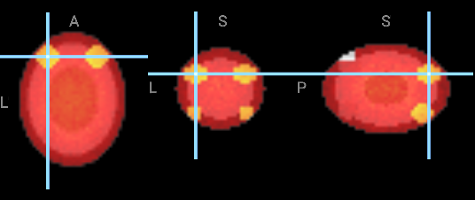

# neurochat

> Ask questions of a brain volume in plain language; get back the figure **and** the `nilearn` code that produced it.

<!-- TODO(release): replace this still with the 60-second screen recording. Record it with:
     `neurochat demo` → click a region → ask "mean uptake in the left hippocampus?" → Export .py → run it.
     The recording goes here, above all prose. -->



*The image above is a real capture from the running app — the backend asked the browser's
WebGL canvas for its pixels, downscaled them, and handed back a path. That round trip is
also how the model sees its own output.*

---

## Install

```bash
pip install . && neurochat demo
```

Two commands from a clone. `demo` opens `http://127.0.0.1:8000` on a **real brain** —
nilearn's ICBM152 2009a template, an average of 152 real brains — with the Harvard-Oxford
subcortical atlas and the crosshair on the left hippocampus. The atlas downloads once
(~26MB) and is cached.

For a run with no network at all, `neurochat demo --offline` uses the bundled synthetic
phantoms instead. Those ship inside the wheel along with the vendored viewer, so the
offline path needs nothing but the install.

*(Not on PyPI yet. When it is, the first command becomes `pip install neurochat`.)*

For development, add the test extras:

```bash
pip install -e ".[dev]" && pytest
```

Chat needs `ANTHROPIC_API_KEY`. Without it every other control still works: clicking a
region navigates, the sliders restyle layers, and the script pane fills up — because
none of that was ever supposed to need a language model.

## Use it from Claude Desktop or Claude Code

The MCP server is the same ten tools over stdio, so your scans stay on your machine —
only small JSON summaries reach the model. It also composes: inside Claude Desktop you
can read subject IDs from a spreadsheet, pull each scan's regional stats, and write the
results into a document, because neurochat is one capability among many rather than a
separate app you have to remember to open.

Open your config:

```bash
open -e ~/Library/Application\ Support/Claude/claude_desktop_config.json
```

(On Windows it lives at `%APPDATA%\Claude\claude_desktop_config.json`.) Add a `neurochat`
entry under `mcpServers`, using the **absolute path** to the executable:

```json
{
  "mcpServers": {
    "neurochat": {
      "command": "/absolute/path/to/.venv/bin/neurochat",
      "args": ["mcp"]
    }
  }
}
```

Then **fully quit and reopen Claude Desktop** — closing the window is not enough; the
config is only read at launch.

> **The absolute path is not optional.** Claude Desktop does not inherit your shell's
> `PATH`, so a bare `"command": "neurochat"` fails to start with an unhelpful error even
> though the same command works fine in your terminal. Get the right path with
> `which neurochat` inside your activated environment. This is the single most common
> reason an MCP server silently fails to connect.

For Claude Code, one command instead:

```bash
claude mcp add neurochat -- /absolute/path/to/.venv/bin/neurochat mcp
```

Headless by default — `screenshot()` renders server-side with nilearn, so a conversation
in Claude Desktop still produces pictures and a runnable script with no browser involved.
To drive an attached viewer instead, run `neurochat serve` in one terminal and point the
MCP server at it:

```bash
neurochat mcp --backend http://127.0.0.1:8000
```

Now the crosshair in the browser moves as the conversation goes, and `screenshot()`
captures what the user is actually looking at.

## What it does

Ten tools, and only ten:

| Tool | Returns |
|---|---|
| `load_volume` | shape, voxel size, affine summary, **detected space and how it was detected**, value range, NaN count |
| `load_atlas` | atlas id, region count, **the full label list** |
| `list_regions` | filtered labels with indices and centroids |
| `navigate` | resolved coordinates **plus the space they are in** |
| `set_display` | applied colormap, window, opacity |
| `overlay` | the layer stack after the operation |
| `roi_stats` | n, mean, sd, median, min, max, **and every excluded voxel, counted** |
| `compare_volumes` | path to a difference or ratio volume, plus summary stats |
| `screenshot` | path to a PNG, downscaled to 768px |
| `export_script` | path to a runnable `.py` |

Every successful call appends a `nilearn`/`nibabel` snippet to a session script. The UI
shows it live. `export_script()` writes a standalone file that needs only numpy, nibabel
and nilearn — not neurochat — and re-running it reproduces the numbers.

That last property is tested, not asserted: a ten-turn session is exported, run in a
fresh interpreter, and its JSON output is compared key by key against what the session
reported. See `tests/test_acceptance.py::TestAcceptance3Reproducibility`.

## Why the coordinates are trustworthy

An LLM asked for "the coordinates of left entorhinal cortex" will produce a confident,
wrong number. So the model never emits one.

- Region names resolve through a lookup table **measured from the loaded atlas volume** —
  centroids computed from the actual mask, not recalled.
- Only exact matches resolve. `"left hippocampos"` is one edit from a real label, which is
  exactly why accepting it is dangerous: it returns the three closest real labels and asks.
- The centroid is used only when it lands inside the structure. Hippocampus is curved
  enough that its centre of mass can sit in the ventricle next door, so each region also
  carries the in-region voxel nearest the centroid, and the response says when it was used.
- Every location states its space: `MNI152NLin6Asym`, `MNI152NLin2009cAsym`, `native`, or
  `voxel[i,j,k]`.
- A volume whose space cannot be established **refuses** named regions and names the
  missing metadata. Grid geometry that happens to match a known template is reported as a
  hint and never used to decide — that is how a scanner-native volume quietly acquires
  MNI region labels.
- That refusal is never a dead end. When geometry suggests a template, the response names
  the one argument that resolves it and the UI offers it as a single button. Accepting is
  recorded as `user_override`: the software still refuses to guess, but you can decide in
  one click, and the provenance says it was you.

```
$ neurochat check --atlas harvard-oxford-sub
Loading atlas 'harvard-oxford-sub'…
  harvard-oxford-sub: 21 regions in MNI152NLin6Asym at 2.0mm
  resolve('Left Hippocampus') -> Left Hippocampus at [-24.9, -22.2, -14.3] MNI152NLin6Asym
    2036 voxels, 16288 mm^3, centroid inside region: True
  resolve('Left Hippocampux') -> did-you-mean ['Left Hippocampus', 'Left Thalamus', 'Left Putamen']

Grounding works: names resolve from the atlas, typos ask instead of guessing.
```

## Prior art, and how this differs

This paradigm is **not novel in general**. It is novel for volumetric human neuroimaging.
Naming your neighbours accurately is a credibility signal; pretending to be first is a
credibility disaster.

**[Omega / `napari-chatgpt`](https://github.com/royerlab/napari-chatgpt)** (Royer lab, CZ
Biohub; *Nature Methods*, June 2024) is the closest published analogue: a conversational
LLM agent as a napari plugin that processes and analyses images, corrects its own coding
mistakes, and chains stateful queries. The team has since moved to `napari-mcp` for
broader LLM compatibility. We take the chained stateful queries and the table-returning
tools. We do not take the one thing that makes Omega work — Omega executes arbitrary
generated Python. That is defensible for a research demo and indefensible for a tool
pointed at patient-derived scans, so our surface is a fixed ten tools (see Hard Rule R3).

**[`AllenNeuralDynamics/neuroglancer-chat`](https://github.com/AllenNeuralDynamics/neuroglancer-chat)**
is the closest neuro analogue: an agent interface for Neuroglancer. We copied its design
outright — a compact `tool_trace` on every response, a bounded `/debug/tool_trace`
endpoint, cached result tables that follow-ups operate on, and the rule that clicking a
row navigates the viewer *without a new LLM call*. Its domain is EM and connectomics
volumes, not NIfTI in MNI space. That is our opening.

**NLI4VolVis** (2025) is the interaction-design precedent for natural-language volume
visualisation, and we did not redesign its four-pane layout. Its two reported failure
modes are our design constraints: LLM latency disrupting interactive flow (addressed by
making every deterministic action bypass the model entirely, and by pushing viewer
commands over a WebSocket as each tool completes, so the crosshair moves before the prose
finishes streaming), and limited domain coverage from predefined tools (addressed by
injecting the atlas's real label vocabulary into context at load time, so the model matches
against strings that exist).

**NeuroAgent** (arXiv, May 2026) automates preprocessing across sMRI, fMRI, dMRI and PET
with a hierarchical Generate-Execute-Validate engine wrapping `dcm2niix` and FreeSurfer.
That territory is claimed, and it is a swamp of 10GB installs and hour-long jobs.
**Preprocessing is a Non-Goal here.** Ask neurochat to run `recon-all` and it will decline
and point you at NeuroAgent, fMRIPrep, or dcm2niix by name.

**[Niivue](https://github.com/niivue/niivue)** renders. We do not write a viewer. Niivue
ships no UI outside the canvas by design, which is exactly the integration point; v0.69.0
is vendored into `web/vendor/` (BSD-2-Clause) so the app needs no CDN and no build step.

**The delta:** nothing equivalent exists for volumetric human neuroimaging — NIfTI volumes,
MNI space, standard atlases, MRI and PET — and nothing in the list above emits reproducible
`nilearn` code as a first-class output.

## New to neuroimaging?

[GLOSSARY.md](GLOSSARY.md) explains every term this project uses — voxel, volume, MNI,
template, atlas, mask, resampling — building up from "what is a scan" rather than
assuming the vocabulary. Written for someone with no background in the field.

## What it will not do

No preprocessing. No statistics or inference. No arbitrary code execution. No custom
viewer. No clinical claims. No accounts or cloud storage. These are enforced, not
aspirational — read [LIMITATIONS.md](LIMITATIONS.md) before using this for anything.

Ask for a t-test and you get a refusal that names `nilearn.glm` and FSL `randomise`,
plus the suggested code written into your script **as a comment**, never executed.

## Data

**The default demo runs on real data.** nilearn ships the ICBM152 2009a template — an
average of 152 real brains — and neurochat pairs it with the real Harvard-Oxford atlas.
Note what happens when it does: the template is a *different* MNI152 variant from the
atlas, and the tool says so rather than quietly absorbing the few-millimetre disagreement.

**Everything in `sample_data/` is synthetic**, generated by `scripts/make_sample_data.py`,
with no subject-derived or third-party material. It exists so the tool — including region
resolution, did-you-mean, and honest NaN accounting — works offline with zero downloads:

| File | What it is |
|---|---|
| `phantom_t1.nii.gz` | structural-like phantom on the FSL MNI152 4mm grid, with a BIDS sidecar |
| `phantom_pet_baseline.nii.gz` | PET-like uptake with a deliberate slab of NaN dropout |
| `phantom_pet_followup.nii.gz` | the same phantom with localised change, for `compare_volumes` |
| `nospace_volume.nii.gz` | identical grid with `sform`/`qform` codes zeroed — the refusal path |
| `demo16_atlas.nii.gz` | 16 geometric regions, **not anatomy** (see LIMITATIONS.md) |

Real atlases — Harvard-Oxford, AAL, Schaefer — are fetched on demand through nilearn and
cached. They are not redistributed here because their licences are not ours to relicense.

## Development

```bash
pip install -e ".[dev]"
python scripts/make_sample_data.py   # regenerate sample data (deterministic)
pytest                               # 103 tests; the seven acceptance tests are in tests/test_acceptance.py
pytest -m "not network"              # skip the tests that fetch a real atlas
neurochat check                      # is atlas grounding working on this machine?
```

## Licence

MIT — see [LICENSE](LICENSE).

Third-party components keep their own terms, listed in [NOTICE.md](NOTICE.md): vendored
Niivue is BSD-2-Clause, and atlases fetched at runtime are **not** redistributed here.
Harvard-Oxford in particular ships with FSL under a licence that restricts commercial
use — check it before publishing work that used it.
